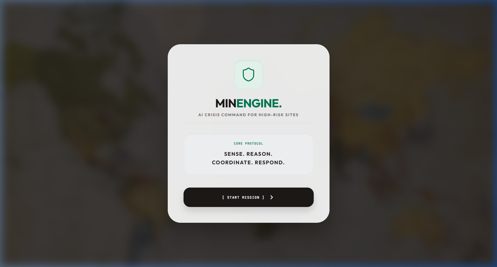
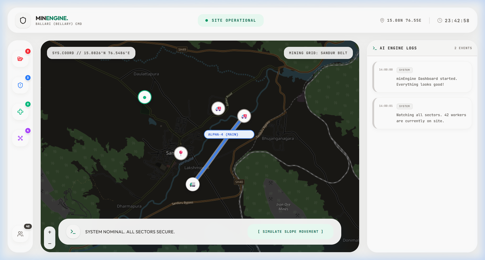

# minEngine 🚨
### AI Crisis Command for High-Risk Sites

**minEngine** is a cutting-edge AI Crisis Command dashboard designed for high-risk industrial environments, such as open-cast mining sites. It provides a real-time, dynamic simulation of hazardous incidents (e.g., landslides) and autonomously coordinates emergency responses, reroutes vehicles, and accounts for personnel.

## 🚀 Features

- **Liquid Glass UI**: Stunning, modern glassmorphic interface built with pure Tailwind CSS and Framer Motion.
- **Dynamic Crisis Simulation**: Injects a live landslide incident, triggering an automated AI response sequence.
- **Real-Time GIS Mapping**: Integrates interactive Leaflet maps with custom vehicle markers, pulsing hazard zones, and dynamic route rendering.
- **Autonomous Replanning**: If an evacuation route is blocked, the AI engine dynamically recalculates and deploys alternate bypass routes.
- **Mission Impact Reporting**: Upon crisis resolution, it generates a detailed comparative impact report (Manual vs. AI) with one-click PDF downloading.
- **Synchronized System Clock**: All logs, sensor data, and UI elements sync in real-time.

## 🛠️ Tech Stack

- **Frontend Framework**: React 19 + TypeScript + Vite
- **Styling**: Tailwind CSS v4
- **Animations**: Framer Motion
- **Maps**: Leaflet + React Leaflet
- **Icons**: Lucide React

## 📸 Screenshots

### 1. Liquid Glass Boot Sequence


### 2. Live Command Dashboard & GIS Tracking


## 🚦 Getting Started

1. **Clone the repository**
   ```bash
   git clone https://github.com/shashankachar19/MinEgine.git
   cd MinEgine
   ```

2. **Install Dependencies**
   ```bash
   npm install
   ```

3. **Run the Development Server**
   ```bash
   npm run dev
   ```

## 🏗️ Project Structure

- `/src/components`: UI components (WelcomeModal, GISMap, ImpactReportModal, etc.)
- `/src/store`: State management (SimContext) handles the progression of the crisis simulation.
- `/public`: Static assets.

## 📝 License
MIT License
